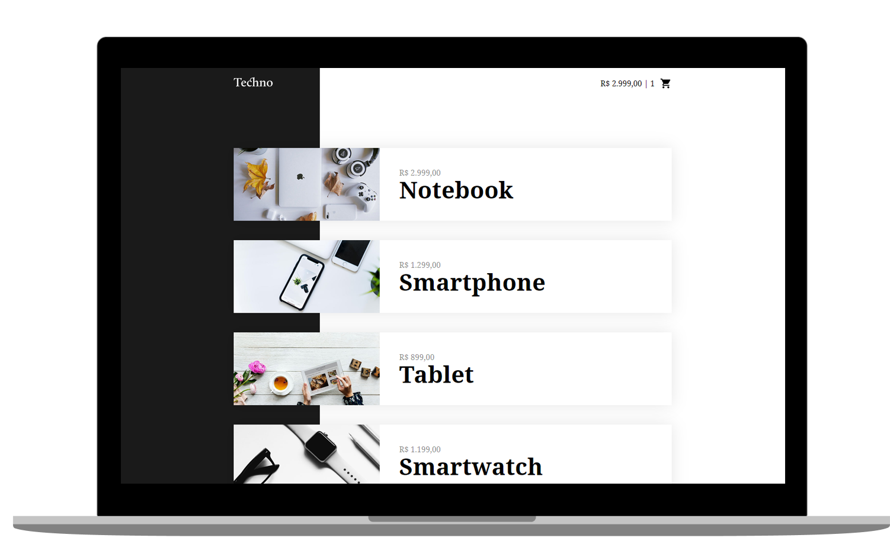

<h1 align="center">
  TECHNO
</h1>

   
  
  
  

  

  

## ◾ Projeto

O projeto Techno foi feito utilizando apenas o CDN do Vue.js. O intuito foi conhecer tudo quer é possivel sem intalar o CLI do Vue.js.

#### Visitar o site: [Techno.com](https://google.com)

## ◾ Tecnologias

Esse projeto foi desenvolvido com as seguintes tecnologias:

- [HTML](https://developer.mozilla.org/pt-BR/docs/Web/HTML)
- [CSS](https://developer.mozilla.org/pt-BR/docs/Web/CSS)
- [JAVASCRIPT](https://developer.mozilla.org/pt-BR/docs/Web/JavaScript)
- [VUEJS](https://br.vuejs.org/index.html)

## ◾ Licença

Esse projeto está sob a licença MIT.
